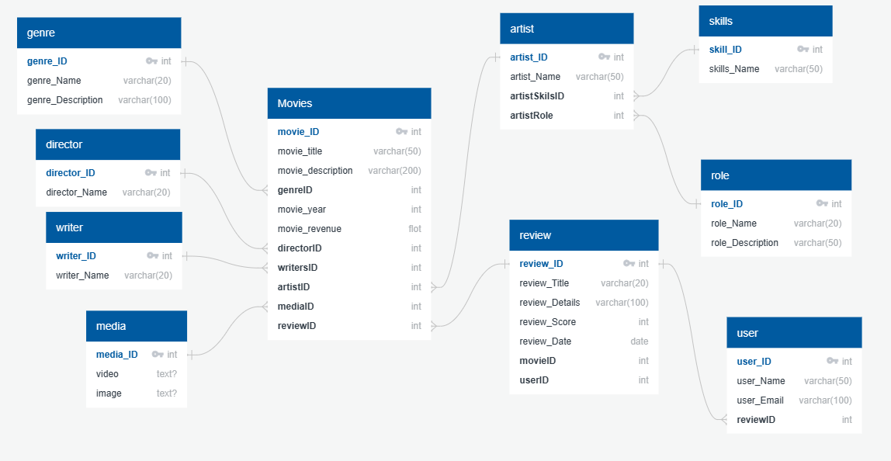

# IMDB DB Design

### Task Details

1. Movie should have multiple media(Video or Image)
2. Movie can belongs to multiple Genre
3. Movie can have multiple reviews and Review can belongs to a user
4. Artist can have multiple skills
5. Artist can perform multiple role in a single film

### Diagrame

### Tables

- movies
- media
- genre
- review
- user
- Artist
- Skills
- role
- director
- writer

### Relationships

| Table  | Relationship | Type        | Column        | References           |
| ------ | ------------ | ----------- | ------------- | -------------------- |
| Movies | Genre        | One-to-One  | genreID       | genre.genre_ID       |
| Movies | Director     | One-to-One  | directorID    | director.director_ID |
| Movies | Writer       | One-to-Many | writersID     | writer.writer_ID     |
| Movies | Artist       | One-to-Many | artistID      | artist.artist_ID     |
| Movies | Media        | One-to-One  | mediaID       | media.media_ID       |
| Movies | Review       | One-to-Many | reviewID      | review.review_ID     |
| User   | Review       | One-to-Many | artistSkilsID | skills.skill_ID      |
| Artist | Skills       | One-to-Many | reviewID      | review.review_ID     |
| Artist | Role         | One-to-One  | artistRole    | role.role_ID         |

### Table and Column Summary:

#### Movies table

###### Columns:

- movie_ID (int, primary key): Unique identifier for each movie.
- movie_title (varchar(50), not null): Title of the movie.
- movie_description (varchar(200), not null): Description of the movie.
- genreID (int, not null): Foreign key referencing the genre table.
- movie_year (int, not null): Year the movie was released.
- movie_revenue (float, not null): Revenue generated by the movie.
- directorID (int, not null): Foreign key referencing the director table.
- writersID (int, not null): Foreign key referencing the writer table.
- artistID (int, not null): Foreign key referencing the artist table.
- mediaID (int, not null): Foreign key referencing the media table.
- reviewID (int, not null): Foreign key referencing the review table.

This table stores information about individual movies, including title, description, genre, release year, revenue, and relationships with other tables like genre, director, writer, artist, and review.

#### media table

##### Columns:

- media_ID (int, primary key): Unique identifier for each media record.
- video (text, null): URL or path to the movie video file.
- image (text, null): URL or path to the movie image.

This table stores information about the media associated with each movie, including the video file and image.

#### genre table

##### Columns:

- genre_ID (int, primary key): Unique identifier for each genre.
- genre_Name (varchar(20), not null): Name of the genre.
- genre_Description (varchar(100), not null): Description of the genre.

This table stores information about different movie genres, including their names and descriptions.

#### review table

##### Columns:

- review_ID (int, primary key): Unique identifier for each review.
- review_Title (varchar(20), not null): Title of the review.
- review_Details (varchar(100), not null): Review details and/or comments.
- review_Score (int, not null): Rating given to the movie (e.g., 1-5 stars).
- review_Date (date, not null): Date the review was written.
- movieID (int, not null): Foreign key referencing the Movies table.
- userID (int, not null): Foreign key referencing the user table.

This table stores information about user reviews for each movie, including title, details, score, date, and relationships with movie and user tables.

#### user table

##### Columns:

- user_ID (int, primary key): Unique identifier for each user.
- user_Name (varchar(50), not null): Username of the user.
- user_Email (varchar(100), not null): Email address of the user.
- reviewID (int, not null): Foreign key referencing the review table.

This table stores information about users who write reviews, including their username, email address, and relationship with the review table.

#### artist table

##### Columns:

- artist_ID (int, primary key): Unique identifier for each artist.
- artist_Name (varchar(50), not null): Name of the artist.
- artistSkilsID (int, not null): Foreign key referencing the skills table.
- artistRole (int, not null): Role played by the artist in the movie

This table stores information about artists involved in movie production, including their name, skills, and role in the movie.

#### skills table

##### Columns:

- skill_ID (int, primary key): Unique identifier for each skill.
- skills_Name (varchar(50), not null): Name of the skill.

This table stores information about different skills artists may possess.

#### role table

##### Columns:

- role_ID (int, primary key): Unique identifier for each role.
- role_Name (varchar(20), not null): Name of the role
- role_Description (varchar(50), not null): Description of the role.

This table stores information about different roles artists may play in movie production.

#### director table

##### Columns:

- director_ID (int, not null, primary key): Unique identifier for each director.
- director_Name (varchar(20), not null): Name of the director.

This table stores basic information about movie directors, including their unique ID and name.

#### writer:

##### Columns:

- writer_ID (int, not null, primary key): Unique identifier for each writer.
- writer_Name (varchar(20), not null): Name of the writer.

This table stores basic information about movie writers, including their unique ID and name.
