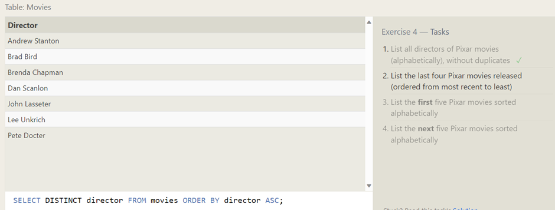

<h1 align=center>   SQL Bolt Tasks

## SELECT queries 101

> ### Exercise 1 - Tasks

#### 1. Find the title of each film.

SQL Query:

```sql
SELECT title FROM movies;
```


#### 2. Find the director of each film.

SQL Query:

```sql
SELECT director FROM movies;
```


#### 3. Find the title and director of each film.

SQL Query:

```sql
SELECT title, director FROM movies;
```


#### 4. Find the title and year of each film.

SQL Query:

```sql
SELECT title, year FROM movies;
```


#### 5. Find all the information about each film.

SQL Query:

```sql
SELECT title, director FROM movies;
```


<hr/>

## Queries with constraints

> ### Exercise 2 – Tasks

#### 1. Find all the information about each film.

SQL Query:

```sql
SELECT * FROM movies WHERE id = 6;
```


#### 2. Find the movies released in the years between 2000 and 2010.

SQL Query:

```sql
SELECT * FROM movies WHERE year BETWEEN 2000 AND 2010;
```


#### 3. Find the movies not released in the years between 2000 and 2010

SQL Query:

```sql
SELECT * FROM movies WHERE year NOT BETWEEN 2000 AND 2010;
```


#### 4. Find the first 5 Pixar movies and their release year.

SQL Query:

```sql
SELECT * FROM movies WHERE id BETWEEN 1 and 5;
```


## Queries with constraints (Pt. 2)

> ### Exercise 3 – Tasks

#### 1. Find all the Toy Story movies.

SQL Query:

```sql
SELECT * FROM movies WHERE title LIKE "%Toy Story%";
```


#### 2. Find all the movies directed by John Lasseter.

SQL Query:

```sql
SELECT * FROM movies WHERE director LIKE "%John Lasseter%";
```


#### 3. Find all the movies (and director) not directed by John Lasseter

SQL Query:

```sql
SELECT title, director FROM movies WHERE director NOT LIKE
```


#### 4. Find all the WALL-\* movies

SQL Query:

```sql
SELECT * FROM movies WHERE title LIKE "%WALL-%";
```


## Filtering and sorting Query results

> ### Exercise 4 – Tasks

#### 1. List all directors of Pixar movies (alphabetically), without duplicates

SQL Query:

```sql
SELECT DISTINCT director FROM movies ORDER BY director ASC;
```



#### 2. List the last four Pixar movies released (ordered from most recent to least)

SQL Query:

```sql
SELECT * FROM movies ORDER BY year DESC LIMIT 4;
```


#### 3. List the first five Pixar movies sorted alphabetically

SQL Query:

```sql
SELECT * FROM movies ORDER BY title ASC LIMIT 5;
```


#### 4. List the next five Pixar movies sorted alphabetically

SQL Query:

```sql
SELECT * FROM movies ORDER BY title ASC LIMIT 5 OFFSET 5;
```


## Simple SELECT Queries

> ### Exercise 5 – Tasks

#### 1. List all the Canadian cities and their populations

SQL Query:

```sql
SELECT city,population FROM north_american_cities WHERE country
```


#### 2. Order all the cities in the United States by their latitude from north to south

SQL Query:

```sql
SELECT city
FROM north_american_cities
WHERE country ="United States"
ORDER BY latitude DESC;
```


#### 3. List all the cities west of Chicago, ordered from west to east

SQL Query:

```sql
SELECT city, longitude
FROM north_american_cities
WHERE longitude < -87.629798
ORDER BY longitude ASC;

```


#### 4. List the two largest cities in Mexico (by population)

SQL Query:

```sql
SELECT * FROM north_american_cities WHERE country ="Mexico" ORDER BY Population desc limit 2;
```


#### 5. List the third and fourth largest cities (by population) in the United States and their population

SQL Query:

```sql
SELECT * FROM north_american_cities WHERE country ="United States" ORDER BY Population desc limit 2 OFFSET 2;
```


## Simple SELECT Queries

> ### Exercise 6 – Tasks

#### 1. Find the domestic and international sales for each movie

SQL Query:

```sql
SELECT title, domestic_sales, international_sales
FROM movies
  JOIN boxoffice
    ON movies.id = boxoffice.movie_id;

```


#### 2. Show the sales numbers for each movie that did better internationally rather than domestically

SQL Query:

```sql
SELECT title, domestic_sales, international_sales
FROM movies
  JOIN boxoffice
    ON movies.id = boxoffice.movie_id
    WHERE international_sales >  domestic_sales;

```


#### 3. List all the movies by their ratings in descending order

SQL Query:

```sql
SELECT title, director, year, rating
FROM movies
  JOIN boxoffice
    ON movies.id = boxoffice.movie_id
    ORDER BY rating desc

```


## OUTER JOINs

> ### Exercise 7 – Tasks

#### 1. Find the list of all buildings that have employees

SQL Query:

```sql
SELECT DISTINCT Building_name
FROM employees
LEFT JOIN Buildings
ON Buildings.Building_name = Employees.Building;

```


#### 2. Find the list of all buildings and their capacity

SQL Query:

```sql
SELECT DISTINCT Building_name , capacity
FROM employees
LEFT JOIN Buildings;

```


#### 3. List all buildings and the distinct employee roles in each building (including empty buildings)

SQL Query:

```sql
SELECT DISTINCT building_name, role
FROM buildings
  LEFT JOIN employees
    ON building_name = building;

```


## A short note on NULLs

> ### Exercise 8 – Tasks

#### 1. Find the name and role of all employees who have not been assigned to a building

SQL Query:

```sql
SELECT name, role
FROM employees
Where building IS NULL;

```


#### 2. Find the names of the buildings that hold no employees

SQL Query:

```sql
SELECT * FROM buildings
left join Employees
on Building_name = Building
WHERE name IS NULL  ;

```


## Queries with expressions

> ### Exercise 9 – Tasks

#### 1. List all movies and their combined sales in millions of dollars

SQL Query:

```sql
SELECT title, (Domestic_sales + International_sales) / 1000000 as SALES FROM movies LEFT JOIN boxoffice on id = movie_id;
```


#### 2. List all movies and their ratings in percent

SQL Query:

```sql
SELECT title, rating, (rating *10) AS percent FROM movies LEFT JOIN BoxOffice ON id = movie_id;
```


#### 3. List all movies that were released on even number years

SQL Query:

```sql
SELECT title, director, year FROM movies WHERE year%2 = 0;
```


## Queries with aggregates (Pt. 1)

> ### Exercise 10 – Tasks

#### 1. Find the longest time that an employee has been at the studio

SQL Query:

```sql
SELECT role, name, MAX(Years_Employed) as Longest_Employed FROM employees;
```


#### 2. For each role, find the average number of years employed by employees in that role

SQL Query:

```sql
SELECT role, avg(years_employed) as Average_Year FROM employees group by role;
```


#### 3. Find the total number of employee years worked in each building

SQL Query:

```sql
SELECT building, SUM(Years_employed) AS Total_Employee FROM employees GROUP BY building;
```


## Queries with aggregates (Pt. 2)

> ### Exercise 11 – Tasks

#### 1. Find the number of Artists in the studio (without a HAVING clause)

SQL Query:

```sql
SELECT role, count(role) as no_of_artist FROM employees where role = "Artist";
```


#### 2. Find the number of Employees of each role in the studio

SQL Query:

```sql
SELECT role, count(name) as No_Of_Employee  FROM employees group by role;
```


#### 3. Find the total number of years employed by all Engineers

SQL Query:

```sql
SELECT role, sum(Years_employed) as total_year FROM employees  group by role having role = "Engineer";
```


## Order of execution of a Query

> ### Exercise 12 – Tasks

#### 1. Find the number of movies each director has directed.

SQL Query:

```sql
SELECT director, count(title) as no_of_movies FROM movies group by director;
```


#### 2. Find the total domestic and international sales that can be attributed to each director.

SQL Query:

```sql
SELECT director,Domestic_sales,International_sales,
    sum(Domestic_sales + International_sales ) as total_sales
    FROM movies
    LEFT JOIN Boxoffice
    on id = movie_id
    group by director;
```


## Inserting rows

> ### Exercise 13 – Tasks

#### 1. Add the studio's new production, Toy Story 4 to the list of movies (you can use any director)

SQL Query:

```sql
INSERT INTO movies values(14,"Toy Story 4","John Lasseter",2020,120);
```


#### 2. Toy Story 4 has been released to critical acclaim! It had a rating of 8.7, and made 340 million domestically and 270 million internationally. Add the record to the BoxOffice table.

SQL Query:

```sql
insert into boxoffice values(14,8.7,340000000,270000000);
```


## Updating rows

> ### Exercise 14 – Tasks

#### 1. The director for A Bug's Life is incorrect, it was actually directed by John Lasseter.

SQL Query:

```sql
UPDATE movies set director = "John Lasseter" where id = 2 ;
```


#### 2. The year that Toy Story 2 was released is incorrect, it was actually released in 1999.

SQL Query:

```sql
UPDATE movies set year = 1999 where title = "Toy Story 2";
```


#### 3. Both the title and director for Toy Story 8 is incorrect! The title should be "Toy Story 3" and it was directed by Lee Unkrich.

SQL Query:

```sql
UPDATE movies set title = "Toy Story 3", director = "Lee Unkrich" where id = 11;
```


## Deleting rows

> ### Exercise 15 – Tasks

#### 1. This database is getting too big, lets remove all movies that were released before 2005.

SQL Query:

```sql
delete FROM movies where year < 2005;
```


#### 2. Andrew Stanton has also left the studio, so please remove all movies directed by him.

SQL Query:

```sql
delete FROM movies where director = "Andrew Stanton";
```


## Creating tables

> ### Exercise 16 – Tasks

#### 1. Create a new table named Database with the following columns:

- Name A string (text) describing the name of the database
- Version A number (floating point) of the latest version of this database
- Download_count An integer count of the number of times this database was downloaded
- This table has no constraints.

SQL Query:

```sql
create table Database(
id integer,
Name varchar(30),
Version float,
Download_count integer

```


## Altering tables

> ### Exercise 17 – Tasks

#### 1. Add a column named Aspect_ratio with a FLOAT data type to store the aspect-ratio each movie was released in.

SQL Query:

```sql
alter table movies add column Aspect_ratio float;
```


#### 2. Add another column named Language with a TEXT data type to store the language that the movie was released in. Ensure that the default for this language is English.

SQL Query:

```sql
alter table movies add column Language text default English;
```


## Dropping tables

> ### Exercise 18 – Tasks

#### 1. We've sadly reached the end of our lessons, lets clean up by removing the Movies table.

SQL Query:

```sql
drop table if exists movies;
```


#### 2. And drop the BoxOffice table as well

SQL Query:

```sql
drop table if exists boxoffice;
```


